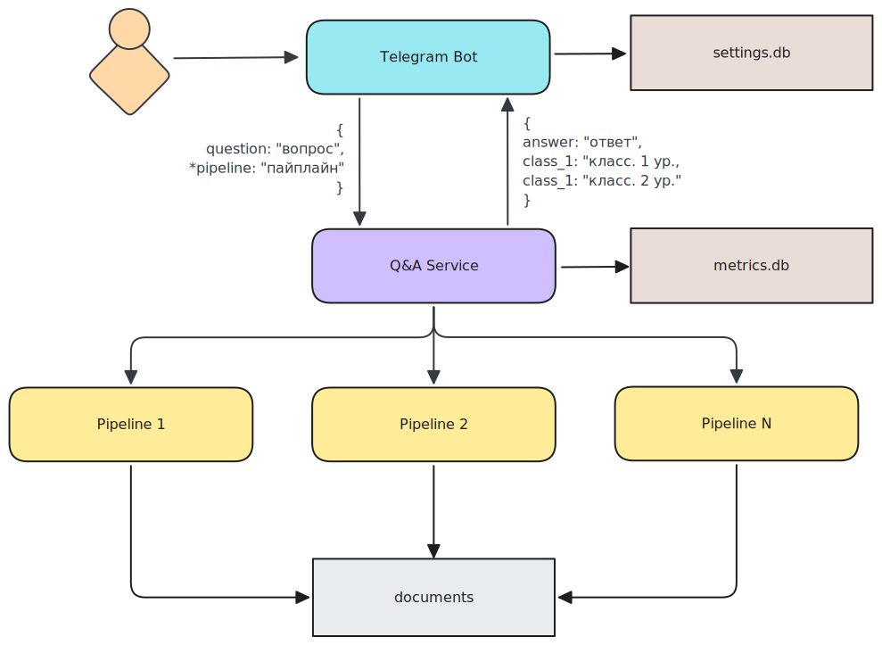

# Rutube: Интеллектуальный помощник оператора службы поддержки

[](https://hub.docker.com/r/airndlab/rutube-qna-bot)
[](https://hub.docker.com/r/airndlab/rutube-qna)
[](https://hub.docker.com/r/airndlab/rutube-qna-pipeline-faq)
[](https://hub.docker.com/r/airndlab/rutube-qna-pipeline-faq-cases)
[](https://hub.docker.com/r/airndlab/rutube-qna-pipeline-baseline)



Состав проекта (читайте подробности внутри под-проектов):

- [bot](bot) - Telegram бот
- [qna-service](qna) - Сервис ответов на вопросы
- Пайплайны:
    - [pipeline-faq](pipelines/faq) - Пайплайн поиска по вопросам FAQ
    - [pipeline-faq-cases](pipelines/faq_cases) - Пайплайн поиска по вопросам FAQ + Кейсам
    - [pipeline-baseline](pipelines/baseline) - Пайплайн кейсхолдеров
- [Данные](data/README.md)
- [Конфигурация](config/README.md)
- [Нагрузочное тестирование](tests/README.md)

## Разработка

Установить:

- python
- poetry

## Сборка

> Настроена сборка через
> [GitHub Actions](https://github.com/airndlab/hackathon-hacks-ai-rutube-qna/actions/workflows/docker.yml).

Установить:

- docker

Перейти в нужный подпроект и запустить:

```
docker build -t <название вашего образа>:<тег вашего образа> .
```

## Конфигурация

- [bot-messages.yml](config/bot-messages.yml) - настройка текста для сообщения бота

## Запуск

Установить:

- docker compose

Создать `.env`:

```properties
BOT_TOKEN=<токен вашего telegram бота>
```

Запустить:

```shell
docker compose up -d
```
